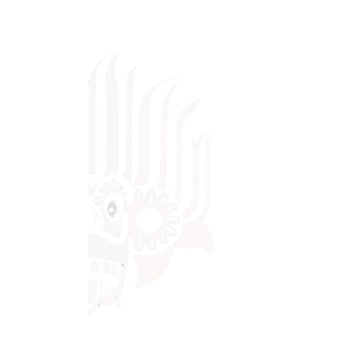

# YAKA UI

<div align="center">



## YAKA UI <sup>v1.0</sup>

**Next-Generation UI Framework powered by GSAP & SVG**

[Documentation](https://yaka-ui.vercel.app/docs.html) •
[Features](#features) •
[Installation](#installation) •
[Usage](#usage) •
[Components](#components)


## Star History

[](https://www.star-history.com/#dill-lk/YAKA-UI&type=date&legend=top-left)

</div>

---

## 🚀 Overview

**Docs:** [https://yaka-ui.vercel.app/docs.html](https://yaka-ui.vercel.app/docs.html)

**YAKA UI** is a lightweight, high-performance UI framework for building stunning interactive interfaces.

Version **1.0** is production-optimized and leverages:

* **GSAP** → ultra-smooth 60fps animations
* **SVG** → crisp scalable graphics
* **ES Modules** → modern architecture
* **CSS Variables** → instant theming

It delivers premium **glassmorphism visuals**, physics-based interactions, and advanced UI motion — without unnecessary bloat.

---

## ✨ Features

* 🎨 Glassmorphism components
* ⚡ GSAP animation engine
* 🧲 Magnetic hover interactions
* 🧊 3D tilt effects
* 🖱️ Custom next-gen cursor
* 📱 Fully responsive design
* 🔧 Modular lightweight core
* 🌗 Fully themeable via CSS variables

---

## 📦 Installation

Include production build via CDN:

```html
<link rel="stylesheet" href="https://cdn.jsdelivr.net/gh/dill-lk/YAKA-UI/yaka_v1.0.css">

<script type="module" src="https://cdn.jsdelivr.net/gh/dill-lk/YAKA-UI/yaka_v1.0.js"></script>
```

> YAKA UI auto-loads GSAP.
> For offline usage, host dependencies locally.

---

## 🔨 Usage

YAKA UI initializes automatically when loaded.

Activate effects using **data attributes**.

### Basic Template

```html
<!DOCTYPE html>
<html lang="en">
<head>
<link rel="stylesheet" href="https://cdn.jsdelivr.net/gh/dill-lk/YAKA-UI/yaka_v1.0.css">
</head>

<body>

<button class="btn-primary" data-magnetic>
Hover Me
</button>

<script type="module" src="https://cdn.jsdelivr.net/gh/dill-lk/YAKA-UI/yaka_v1.0.js"></script>

</body>
</html>
```

---

## 🧩 Components

### Buttons

```html
<button class="btn-primary" data-magnetic>
<span>Get Started</span>
</button>

<button class="btn-glitch" data-text="CYBER">
CYBER
</button>
```

---

### Glass Cards

```html
<div class="card glass-card" data-tilt>
<div class="card-content">
<h3>Smart Card</h3>
<p>Interactive glassmorphism with 3D tilt.</p>
</div>
<div class="card-border"></div>
</div>
```

---

## 📈 Star History

*(Add chart later using star-history.com embed if wanted)*

---

## 👨‍💻 Developed By

Maintained by
**dill-lk**

<a href="https://github.com/dill-lk">

</a>

Project under
**YAKA UI Labs**
[https://github.com/yaka-ui-labs](https://github.com/yaka-ui-labs)

---

## 📄 License

MIT License — see `LICENSE` file.

---

<div align="center">

Made with ❤️ by **dill-lk** & YAKA UI Team

</div>

---
